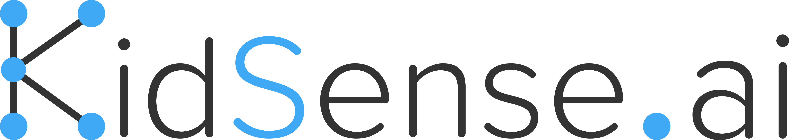

<p align="center">
  
</p>

# Vocally Android Demo

This demo contains Kidsense EDGE ASR SDK along with VAD (Voice Activity Detection) and Audio Recorder SDK. Open this project in Android Studio. 

* To run this demo register yourself on **[Kidsense Development Portal](https://developer.kidsense.ai)** and get your API key. Use this API key as follows

```java
_koManager.initModels(configPath,"your-api-key-here");
```

* There are two ASR models in this repo. Model details are as follows

| Model Name | Size | Vocabulary Size |
| --- | --- | --- |
| English Small | 11MB | 1k |
| English Medium | 15.7MB | 15k |
| English Large | 50MB | 68k |

* To use small model uncomment following line

```java
  String configPath = Kidsense_en_small_v1.autoSync(MainActivity.this);
```

* To use medium model uncomment follwing line

```java
  String configPath = Kidsense_en_medium_v1.autoSync(MainActivity.this);
```

* To use large model uncomment follwing line

```java
  String configPath = Kidsense_en_large_v1.autoSync(MainActivity.this);
```

* You can also create the custom model using our online interface **[Model Generator](https://developer.kidsense.ai/)**.


**Note**

**The Kidsense EDGE ASR SDK can be used only for 10 minutes contineously or for 50 queries after that SDK will automatically crash.** 
